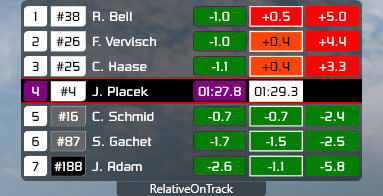
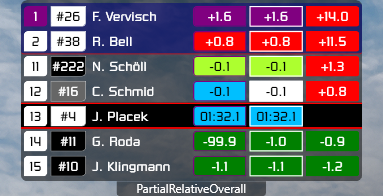
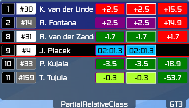
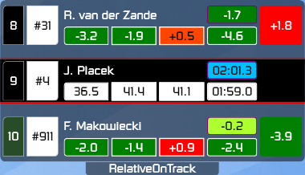
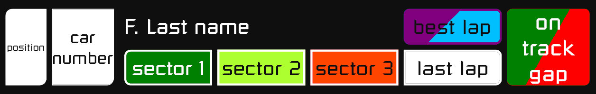

# Simhub relative leaderboard overlay

## screens

  

## screen 1

## screen 2

## background colors

| position box color                                                    | delta box color                                                          | times box color                                                       |
| --------------------------------------------------------------------- | ------------------------------------------------------------------------ | --------------------------------------------------------------------- |
|    GT3               |          more than +0.5s     |       session best lap |
|    GT4               |    from +0.1s to +0.5s |  driver best lap  |
|   Super Trofeo 2015 |        from +0.1s to -0.1s |        driver last lap  |
|   Super Trofeo 2021 |  from -0.1s to -0.5s |
|    Ferrari Challenge |        less than -0.5s     |
|  Porsche CUP 2017  |        car in pit lane*    |
|  Porsche CUP 2021  |    car finished*       |
|    TCX               |

* only in `on track gap` box

## dependencies

- [SimHub V8.0.1](https://www.simhubdash.com/download-2/)
- [SimHub ACC Dynamic Leaderboards Plugin](https://github.com/kaiusl/KLPlugins.DynLeaderboards) (tested on [v1.1.1](https://github.com/kaiusl/KLPlugins.DynLeaderboards/releases/tag/v1.1.1))

## setup

### Dynamic Leaderboards Plugin

[Plugin Getting started instructions](https://github.com/kaiusl/KLPlugins.DynLeaderboards#getting-started)

go to **SimHub** -> **DynLeaderboard** side tab -> **Dynamic leaderboards** tab

#### dynamic leaderboards
- `Add new leaderboard` (or rename default one)
- (re)name it `gaps`

#### leaderboard rotation
- :white_check_mark: RelativeOnTrack
- :ballot_box_with_check: RelativeOverall
- :ballot_box_with_check: RelativeClass
- :ballot_box_with_check: PartialRelativeOverall
- :ballot_box_with_check: PartialRelativeClass

#### number of positions
- overall leaderboards: 7
- relative leaderboards: 3
- partial relative leaderboards : top 2, relative 2

#### properties for each car
- `Car information`
  - :white_check_mark: Car.Number
  - :white_check_mark: Car.Class
  - :white_check_mark: Car.Class.Color
  - :white_check_mark: Team.CupCategory.Color
  - :white_check_mark: Team.CupCategory.TextColor
- `Lap information`
  - :white_check_mark: Laps.Last.Time
  - :white_check_mark: Laps.Last.S1/2/3
  - :white_check_mark: Laps.Best.Time
  - :white_check_mark: Laps.Best.S1/2/3
- `Best to best`
  - :white_check_mark: Laps.Best.Delta.ToOverallBest
  - :white_check_mark: Laps.Best.Delta.ToClassBest
  - :white_check_mark: Laps.Best.Delta.Dynamic.ToFocusedBest
- `Last to best`
  - :white_check_mark: Laps.Last.Delta.ToOverallBest
  - :white_check_mark: Laps.Last.Delta.ToClassBest
- `Last to last`
  - :white_check_mark: Laps.Last.Delta.ToFocusedLast
- `Gaps`
  - :white_check_mark: Gap.ToFocused.OnTrack
- `Positions`
  - :white_check_mark: Position.Overall
  - :white_check_mark: Position.Class
- `Pit information`
  - :white_check_mark: Pit.IsIn
- `Other`
  - :white_check_mark: IsFinished
  - :white_check_mark: IsFocused
  - :white_check_mark: IsOverallBestLapCar
  - :white_check_mark: IsClassBestLapCar
  - :white_check_mark: RelativeOnTrackLapDiff

#### properties for each driver
- `Names`
  - :white_check_mark: InitialPlusLastName

*:white_check_mark: - required  
*:ballot_box_with_check: - optional

### overlay setup

- download latest release from [here](https://github.com/serek4/simhub-gaps-overlay/releases)
- import [gaps-overlay.simhubhash](gaps-overlay.simhubdash) to SimHub (double click)
- copy [gaps-overlay-src.js](gaps-overlay-src.js) and [gaps-overlay-screen.js](gaps-overlay-screen.js) to  
  `C:\Program Files (x86)\SimHub\JavascriptExtensions` folder

### overlay controls

- to switch between screens go to **SimHub** -> **Dash Studio** side tab -> **settings** tab and  
  add mapping for `Show next dash screen` and/or `Show previous dash screen`
- to switch between leader boards go to **SimHub** -> **Controls and events** side tab and  
  add mapping for `DynLeaderboardsPlugin.gaps.NextLeaderboard` and/or `DynLeaderboardsPlugin.gaps.PreviousLeaderboard`
