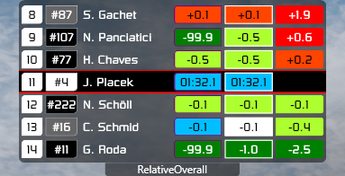

# Simhub relative leaderboard overlay

## screens

  

## dependencies

- [SimHub V8.0.1](https://www.simhubdash.com/download-2/)
- [SimHub ACC Dynamic Leaderboards Plugin](https://github.com/kaiusl/KLPlugins.DynLeaderboards) (tested on [v1.1.1](https://github.com/kaiusl/KLPlugins.DynLeaderboards/releases/tag/v1.1.1))

## setup

### Dynamic Leaderboards Plugin

:white_check_mark: - required  
:ballot_box_with_check: - optional

#### dynamic leaderboards
- `Add new leaderboard` (or rename default one)
- (re)name it `gaps`

#### leaderboard rotation
- :white_check_mark: RelativeOnTrack
- :ballot_box_with_check: RelativeOverall
- :ballot_box_with_check: RelativeClass
- :ballot_box_with_check: PartialRelativeOverall
- :ballot_box_with_check: PartialRelativeClass

#### number of positions
- overall leaderboards: 7
- relative leaderboards: 3
- partial relative leaderboards : top 2, relative 2

#### properties for each car
- `Car information`
  - :white_check_mark: Car.Number
  - :white_check_mark: Car.Class
  - :white_check_mark: Team.CupCategory.Color
  - :white_check_mark: Team.CupCategory.TextColor
- `Lap information`
  - :white_check_mark: Laps.Last.Time
  - :white_check_mark: Laps.Last.S1/2/3
  - :white_check_mark: Laps.Best.Time
  - :white_check_mark: Laps.Best.S1/2/3
- `Best to best`
  - :white_check_mark: Laps.Best.Delta.Dynamic.ToFocusedBest
- `Last to last`
  - :white_check_mark: Laps.Last.Delta.ToFocusedLast
- `Gaps`
  - :white_check_mark: Gap.ToFocused.OnTrack
- `Positions`
  - :white_check_mark: Position.Overall
- `Pit information`
  - :white_check_mark: Pit.IsIn
- `Other`
  - :white_check_mark: IsFocused
  - :white_check_mark: IsOverallBestLapCar
  - :white_check_mark: RelativeOnTrackLapDiff

#### properties for each driver
- `Names`
  - :white_check_mark: InitialPlusLastName

### Overlay
- import [gaps-overlay.simhubhash](gaps-overlay.simhubhash) to simhub (double click)
- copy [gaps-overlay-src.js](gaps-overlay-src.js) and [gaps-overlay-screen.js](gaps-overlay-screen.js) to `C:\Program Files (x86)\SimHub\JavascriptExtensions` folder
