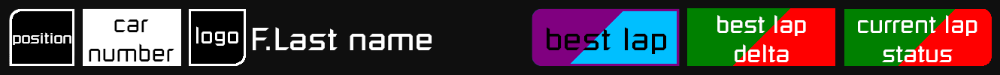
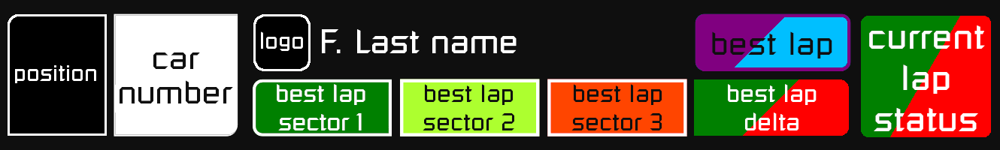

# Simhub relative leaderboard overlay

### race

 
 

### qualify

 
 

## background colors

| position box color                                                    | delta box color                                                          | time box color                                                        | current lap status                                         |
| --------------------------------------------------------------------- | ------------------------------------------------------------------------ | --------------------------------------------------------------------- | ---------------------------------------------------------- |
|    GT3               |          more than +0.5s     |       session best lap |     fast lap |
|    GT4               |    from +0.1s to +0.5s |  driver best lap  |    invalid lap |
|   Super Trofeo 2015 |        from +0.1s to -0.1s |        driver last lap  |  out lap |
|   Super Trofeo 2021 |  from -0.1s to -0.5s |                                                                       |       in pit |
|    Ferrari Challenge |        less than -0.5s     |
|  Porsche CUP 2017  |        car in pit lane*    |
|  Porsche CUP 2021  |    car finished*       |
|    TCX               |

* only in `on track gap` box

## dependencies

- [SimHub V8](https://www.simhubdash.com/download-2/) (tested on 8.2.3)
- [SimHub ACC Dynamic Leaderboards Plugin v1.2.2](https://github.com/kaiusl/KLPlugins.DynLeaderboards/tree/v1.2.2)

## setup

### Dynamic Leaderboards Plugin

all data comes from plugin so first go to [Plugin Getting started instructions](https://github.com/kaiusl/KLPlugins.DynLeaderboards/tree/v1.2.2#getting-started) and setup plugin

#### leaderboard rotation

by default overlay have this leaderboards:
- RelativeOnTrackWoPit
- RelativeOverall
- PartialRelativeClass

you can use any relative leaderboard you want and reorder them in  
SimHub -> DynLeaderboard side tab -> Dynamic leaderboards tab  

leaderboard name `gaps`

### overlay setup

- download [latest](https://github.com/serek4/simhub-gaps-overlay/releases/latest) release
- import `gaps-overlay-v1.5.simhubdash` to SimHub (double click)
- copy content of SimHub folder to SimHub root folder `C:\Program Files (x86)\SimHub\`
- restart SimHub

### overlay controls

- to switch between screens go to **SimHub** -> **Dash Studio** side tab -> **settings** tab and  
  add mapping for `Show next dash screen` and/or `Show previous dash screen`
- to switch between leader boards go to **SimHub** -> **Controls and events** side tab and  
  add mapping for `DynLeaderboardsPlugin.gaps.NextLeaderboard` and/or `DynLeaderboardsPlugin.gaps.PreviousLeaderboard`
- to switch between gaps and lap times go to **SimHub** -> **Controls and events** side tab and  
  add mapping for `GraphicalDashPlugin.actionA`
